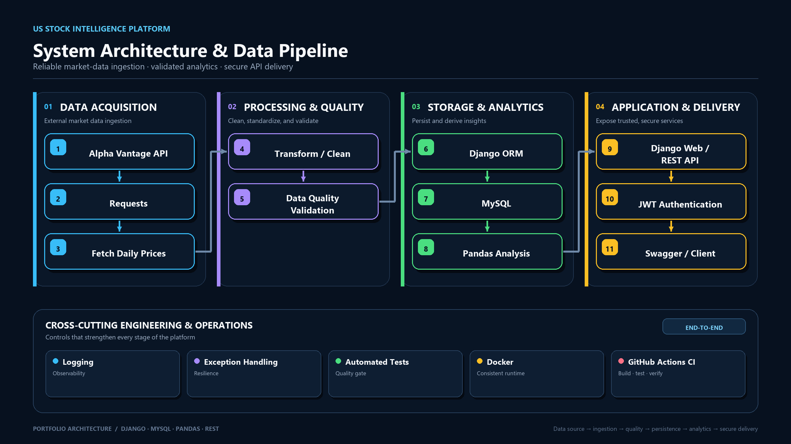
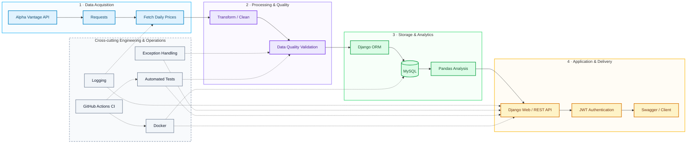

# US Stock Intelligence Platform


美股資料分析與投資資訊平台


## Project Overview


US Stock Intelligence Platform 是一個以 Python、Django、MySQL 建立的美股資料分析與後端資料服務專案。

系統整合外部股票 API，將每日 OHLCV 股價資料經過資料清理、驗證與轉換後寫入 MySQL，並透過 Django ORM、Pandas 與 Django REST Framework 提供股票查詢、歷史價格、資料分析與 REST API。

本專案著重於後端工程與資料流程設計，包含 JWT Authentication、Data Pipeline、Data Quality Validation、Logging、Exception Handling、Automated Tests、Docker、GitHub Actions CI 與 OpenAPI / Swagger 文件。


## System Architecture

The platform follows an end-to-end data pipeline—from external market data ingestion and quality validation to analytics and secure API delivery.



> Alpha Vantage API → Data Ingestion → Validation → MySQL → Pandas Analysis → Django REST API → JWT Authentication → Swagger / Client

<details>
<summary><strong>View Mermaid architecture diagram</strong></summary>



</details>

## Tech Stack


- Python 3.14
- Django 6.1
- Django REST Framework
- Simple JWT
- drf-spectacular
- MySQL 8.4
- Django ORM
- Pandas
- NumPy
- Requests
- HTML / CSS / JavaScript
- Docker
- Docker Compose
- GitHub Actions
- Git / GitHub


## Project Status


🚧 Under Development

目前核心後端功能已完成，包含 REST API、JWT Authentication、Data Pipeline、Data Quality Validation、Logging、Exception Handling、Automated Tests、Docker、GitHub Actions CI 與 OpenAPI / Swagger 文件。

目前進入專案文件整理、架構圖、Demo 與面試準備階段。


## Features

- 股票搜尋與個股詳細資訊
- 歷史 OHLCV 股價資料查詢
- Pandas 技術分析
  - 5 / 10 / 20 日平均收盤價
  - 報酬率
  - 波動率
  - 成交量變化
  - 30 日高低點距離
- REST API
- JWT Authentication
- Alpha Vantage Data Pipeline
- Data Quality Validation
- Logging 與 Exception Handling
- Automated Tests
- Docker / Docker Compose
- GitHub Actions CI
- OpenAPI / Swagger API Documentation


## API Endpoints

| Method | Endpoint | Description |
|---|---|---|
| GET | `/api/stocks/` | 取得股票清單 |
| GET | `/api/stocks/{symbol}/` | 取得單一股票基本資料 |
| GET | `/api/stocks/{symbol}/prices/` | 取得歷史股價資料 |
| POST | `/api/token/` | 取得 JWT access / refresh token |
| POST | `/api/token/refresh/` | 更新 JWT access token |

### Query Parameters

`GET /api/stocks/{symbol}/prices/`

- `limit`
  - 預設值：`100`
  - 範圍：`1` ～ `100`

### API Documentation

- OpenAPI Schema: `/api/schema/`
- Swagger UI: `/api/docs/`


## Run Instructions

### 1. Clone Repository

```bash
git clone https://github.com/winillnwang/US-Stock-Intelligence-Platform.git
cd US-Stock-Intelligence-Platform
```

### 2. Create Environment Variables

在專案根目錄建立 `.env` 檔案：

```env
DB_NAME=us_stock_db
DB_USER=root
DB_PASSWORD=your-password
DB_HOST=127.0.0.1
DB_PORT=8888
ALPHA_VANTAGE_API_KEY=your-api-key
```

### 3. Install Dependencies

```bash
pip install -r requirements.txt
```

### 4. Run Django Locally

```bash
cd backend
python manage.py migrate
python manage.py runserver
```

### 5. Run with Docker Compose

```bash
docker compose up --build
```

### 6. API Documentation

啟動服務後，可開啟：

- Swagger UI: `http://127.0.0.1:8000/api/docs/`
- OpenAPI Schema: `http://127.0.0.1:8000/api/schema/`
